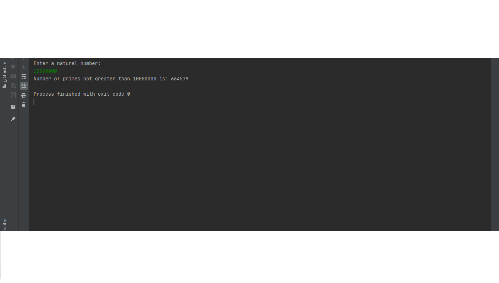

# Number-of-primes-not-greater-than-n
Java program to count the number of prime numbers less than some natural number.
This is the prime-counting function and here is a few their values:
for 10: 4,
for 100: 25,
for 1000: 168,
for 10000: 1229,
for 100000: 9592,
for 1000000: 78498.
This program good works for numbers less than  10 000 000. For greater numbers the calculations are getting longer. 

